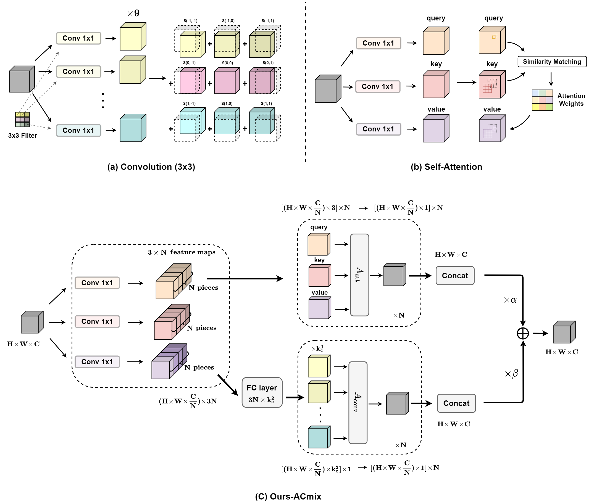

# On the Integration of Self-Attention and Convolution (ACmix)
This repo contains the official **PyTorch** code and pre-trained models for ACmix [[Arxiv]](https://arxiv.org/pdf/2111.14556v1.pdf).

### Introduction



We explore a closer relationship between convolution and self-attention in the sense of sharing the
same computation overhead (1×1 convolutions), and combining with the remaining lightweight aggregation operations.

### Results

+ Top-1 accuracy on ImageNet v.s. Multiply-Adds


### Pretrained Models

| Backbone Models | Params | FLOPs | Top-1 Acc   | Links                                                        |
| --------------- | ------ | ----- | ----------- | ------------------------------------------------------------ |
| SAN-10          | 12.1M  | 1.9G  | 77.6 (+0.5) | In process                                                   |
| SAN-15          | 16.6M  | 2.7G  | 78.4 (+0.4) | In process                                                   |
| SAN-19          | 21.2M  | 3.4G  | 78.7 (+0.5) | In process                                                   |
| PVT-T           | 13M    | 2.0G  | 78.0 (+2.9) | In process                                                   |
| PVT-S           | 25M    | 3.9G  | 81.7 (+1.9) | In process                                                   |
| Swin-T          | 30M    | 4.6G  | 81.9 (+0.6) | [Tsinghua Cloud](https://cloud.tsinghua.edu.cn/f/210c89a6f9eb4bd0beb6/) / [Google Drive](https://drive.google.com/file/d/1qJnYhtQ65rWd0zUuV9eZQW5Wxj-TiiSg/view?usp=sharing) |
| Swin-S          | 51M    | 9.0G  | 83.5 (+0.5) | [Tsinghua Cloud](https://cloud.tsinghua.edu.cn/f/8bed555e75c840f8a00d/) / [Google Drive](https://drive.google.com/file/d/12PhN5YOEtWAgO8eSLhopfCVZ7JozMf9T/view?usp=sharing) |

### Contact

If you have any question, please feel free to contact the authors. Xuran Pan: [pxr18@mails.tsinghua.edu.cn](mailto:pxr18@mails.tsinghua.edu.cn).

### Acknowledgment

Our code is based on [SAN](https://github.com/hszhao/SAN), [PVT](https://github.com/whai362/PVT), and [Swin Transformer](https://github.com/microsoft/Swin-Transformer).

### Citation

If you find our work is useful in your research, please consider citing:

```bibtex
@misc{pan2021integration,
      title={On the Integration of Self-Attention and Convolution}, 
      author={Xuran Pan and Chunjiang Ge and Rui Lu and Shiji Song and Guanfu Chen and Zeyi Huang and Gao Huang},
      year={2021},
      eprint={2111.14556},
      archivePrefix={arXiv},
      primaryClass={cs.CV}
}
```

